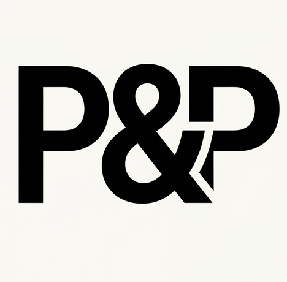

# 🛍️ Picked & Packed

> A responsive e-commerce web app powered by DummyJSON API. Features product search, category filtering, cart & wishlist — built with Vanilla JavaScript & Tailwind CSS.



---

## 🌍 Live Demo

🔗 [https://picked-n-packed.vercel.app](https://picked-n-packed.vercel.app)

---

## 📌 Project Purpose

Picked & Packed is a fully responsive online shopping application where users can discover products across a wide range of categories, search and filter by their preferences, manage a personal cart, and save items to a wishlist.

This project was built as part of a web development course to demonstrate practical skills in API integration, array manipulation using Higher-Order Functions, and modern UI design — using only Vanilla JavaScript with no frameworks.

---

## 🌐 API Used

**DummyJSON** — [https://dummyjson.com](https://dummyjson.com)

- Free to use, no API key required
- 190+ products across 20+ categories
- Built-in support for search, pagination, sorting, and filtering
- Key endpoints used:
  - `GET /products` — fetch all products
  - `GET /products/search?q={query}` — search products by keyword
  - `GET /products/categories` — fetch all categories
  - `GET /products/category/{category}` — fetch products by category
  - `GET /products?sortBy=price&order=asc` — fetch sorted products
  - `GET /products?limit={limit}&skip={skip}` — fetch paginated products

---

## ✨ Planned Features

### Core Features

- **Product Listing** — Display products as responsive cards with image, title, price, discount, and star rating
- **Search** — Search products by name/keyword in real time using array `filter()`
- **Filter by Category** — Filter products across 20+ categories using array `filter()`
- **Sort** — Sort by price (low→high, high→low) or by rating using array `sort()`
- **Add to Cart** — Add/remove products with live cart count badge and total price
- **Wishlist / Favorites** — Save favourite products, persisted using `localStorage`

### Bonus Features (if time permits)

- **Dark Mode / Light Mode** toggle, preference saved in `localStorage`
- **Debounced Search** — Avoids excessive filtering on every keystroke
- **Loading Skeleton** — Placeholder cards shown while data is being fetched
- **Pagination** — Browse products across multiple pages

---

## 🛠️ Technologies Used

| Technology        | Purpose                                         |
| ----------------- | ----------------------------------------------- |
| HTML5             | Page structure and semantic markup              |
| Tailwind CSS      | Utility-first styling and responsive design     |
| JavaScript (ES6+) | Logic, API calls, DOM manipulation, array HOFs  |
| DummyJSON API     | Product data source                             |
| LocalStorage      | Persisting cart, wishlist, and theme preference |

---

## 🚀 How to Run

1. Clone the repository:

   ```bash
   git clone https://github.com/daksheshsharma2409/picked_n_packed.git
   ```

2. Navigate into the project folder:

   ```bash
   cd picked_n_packed
   ```

3. Open `index.html` directly in your browser, or use Live Server in VS Code:
   ```
   Right-click index.html → Open with Live Server
   ```

> No installation or build step needed — runs entirely in the browser.

---

## 📅 Project Milestones

| Milestone      | Description                                   | Deadline   |
| -------------- | --------------------------------------------- | ---------- |
| ✅ Milestone 1 | Project setup, idea planning, README          | 23rd March |
| ✅ Milestone 2 | API integration, display data, responsiveness | 1st April  |
| 🔲 Milestone 3 | Search, filter, sort, cart, wishlist          | 8th April  |
| 🔲 Milestone 4 | Final cleanup, documentation, deployment      | 10th April |

---

## 👤 Author

**Dakshesh Sharma**
GitHub: [@daksheshsharma2409](https://github.com/daksheshsharma2409)
